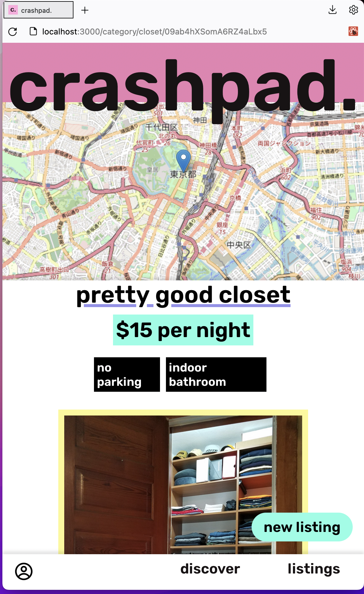

# crashpad.
#### a temporary housing marketplace for vagabonds

this is a tongue-in-cheek app meant to possess similar functionality
to airBnB.

### roadmap

- [ ] right now 'discover' page is merely a placeholder
- [ ] dream up better styling for all listings page
- [ ] delete/edit listings
- [ ] better geocoding from address (current free API is limited to more vague queries)
- [ ] in-app messaging between users, currently only mailto: on listing page

### tools

- firebase
- leaflet
- nanoid
- rc-textarea
- react-hot-toast
- react-icons
- styled-components
- swiper